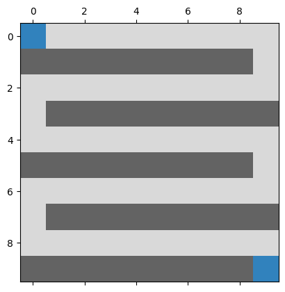

# GenAlgo_MazeSolving

Des explications plus approfondies ainsi que des tests sont disponibles dans le rapport : https://github.com/ThePension/GenAlgo_MazeSolving/blob/main/doc/TP4_Aubert_Report.pdf

## Fonctionnement de l'algorithme génétique
### **Définition d'un gène**
Un gène peut prendre les 4 valeurs suivantes :
- 0 = Déplacement vers la gauche,
- 1 = Déplacement vers la droite,
- 2 = Déplacement vers le haut,
- 3 = Déplacement vers le bas

### **Définition d'un chromosome (ADN)**
Un chromosome compose un individu ; une analogie avec l'ADN qui compose l'humain peut être utilisée afin de mieux visualiser cette notion.

Un chromosome est une suite, d'une certaine longueur, de gènes. Un chromosome, à partir d'une position initiale, peut être appliqué afin d'obtenir une position finale.
Cela est fait dans la fonction de `compute_complete_valid_path` décrite ci-dessous.

**Taille d'un chromosome**

La labyrinthe menant à un chemin de taille maximale est la forme suivante :

Le chemin le plus long possède donc un longueur de (Width * Length) / 2. La taille des chromosomes dans cette implémentation se base sur cette formule.

### **Récupération du chemin à partir de l'ADN (compute_complete_valid_path)**
Afin de générer le chemin lié au chromosome, il suffit, pour chaque gène, d'appliquer le déplacement à la position actuelle, et d'ajouter celle-ci dans une liste pour garder une trace des positions empruntées.

Lors de la première version de mon implémentation, si appliquer la gène actuelle résidait en une position illégale (mur, en dehors du tableau), celle-ci n'était juste pas appliquée. Une autre approche a été mise en place par la suite, afin de prévenir les cul-de-sac.

**Prévenir les cul-de-sac**

Si l'application d'une gène génère une position illégale, la gène actuelle est alors transformée en un autre déplacement, jusqu'à ce que celui-ci donne une position légale.

Si aucun des quatre types de gène ne permet d'obtenir une position légale, alors la position actuelle est un cul-de-sac, et sera considérée comme un mur (fictif) jusqu'à la fin de la génération du chemin, pour ce chromosome uniquement.

### **Récupération du chemin le plus court (compute_subpath)**
La première étape consiste à retirer les positions dupliquées consécutives : par exemple, si une partie du chemin est composé de `[..., (1, 2), (1, 2), (1, 3), ...]`, il deviendra alors `[..., (1, 2), (1, 3), ...]`.

Par la suite, une fois la redondance éliminée, la fonction regarde si la position souhaitée (*target*) est contenue dans le chemin. Si c'est le cas, elle retourne le chemin à partir de la dernière position `(0, 0)` se trouvant avant la *target*, jusqu'à la première position correspondant à la *target*.

Si la *target* ne se trouve dans le chemin, le même raisonnement est appliqué, mais en prenant comme *target* la position la plus proche de la *target* dans le chemin (distance euclidienne).

### **Fonction de Sélection**

La fonction de sélection permet d'obtenir les meilleurs individus dans la population. À des fins d'optimisations, la fonction de sélection `tools.selTournament()`, fourni par `deap` a été utilisée, avec un taille de tournoi (`tournsize`) valant 3.  

### **Fonction de Crossover**
La fonction de crossover permet, à partir de deux parents, d'obtenir deux enfants, dont les chromosomes sont basés sur ceux de leurs géniteurs. La transmission des chromosomes se fait en un seul point. Cela signifie que les chromosomes des parents seront divisés en deux : le chromosome du premier enfant sera composé de la première partie du chromosome du premier parent ainsi que de la deuxième partie du chromosome du deuxième parent. Le chromosome du deuxième enfant sera composé de la deuxième partie du chromosome du premier parent ainsi que de la première partie du chromosome du deuxième parent.

Voici un exemple afin d'illustrer ce paragraphe complexe : Le chromosome du premier parent est `[1, 1, 1, 1, 1, 1, 1, 1, 1, 1]`, celui du deuxième vaut `[0, 0, 0, 0, 0, 0, 0, 0, 0, 0]`.

Les chromosomes des enfants seront donc : 
- `[1, 1, 1, 1, 1, 0, 0, 0, 0, 0]`
- `[0, 0, 0, 0, 0, 1, 1, 1, 1, 1]`

### **Fonction de Mutation**
La fonction de mutation permet d'apporter des modifications aléatoires aux gènes d'un chromosome.

Chaque individu possède un certain pourcentage de mutation à chaque génération. Ce taux a pour valeur : 0.8, ce qui correspond à 80%.

Pour muter un individu, chaque gène de chromosome est passé en revu, et muté en fonction du taux de mutation individual d'un gène, valant 0.1 (10%).

Ces mutations modifient, par palier de 1, certains gènes. Par exemple, un gène possédant la valeur 2 pourra devenir 1 ou 3.

### **Fonction de Fitness**
La fonction de fitness `compute_fitness()` permet de calculer la fitness d'un individu, qui peut être comparée à un score, permettant de classer les individus. Dans cette simulation, plus la fitness est faible, meilleur est l'individu.

La première étape consiste à construire le chemin emprunté par l'individu, basé sur son chromosome, à l'aide de la fonction `compute_subpath()`.

Si l'individu atteint la cible à un moment dans son chemin, sa fitness est alors le nombre d'étapes afin de s'y rendre. Comme précisé précédemment, si la cible est atteinte, la fonction `compute_subpath()` retourna le chemin le plus court menant à cette cellule. Cela signifie que la dernière cellule du chemin est alors la cellule cible. Le nombre d'étapes est donc la longueur du chemin.

Si l'individu n'atteint pas la cible, la dernière cellule de son chemin sera la cellule la plus proche de la cellule cible (*closest_cell*). Sa fitness est alors la longueur du chemin, à laquelle est additionnée la distance euclidenne séparant cette cellule de la cible.

## **Résultats obtenus**

TODO

## **Améliorations / optimisations potentielles**
### **Critère(s) d'arrêt**
Pour l'instant, le seul critère d'arrêt de cet algorithme est le temps écoulé. Si celui-ci dépasse le temps maximale précisé dans les paramètres de la fonction `solve_labyrinthe()`, le chemin du meilleur individu trouvé jusqu'à présent est retourné.

Un second critère pourrait être mis en place : **la convergence**. Si, à partir d'un certain nombre de générations, les individus n'évoluent plus, cela signifie que la diversité dans la population s'est très affaiblie. Le seul moyen d'obtenir de nouveaux résultats dépend uniquement de la mutation des individus. 

## **Sources**
- https://science.donntu.edu.ua/ipz/sobol/links/maze_solving.pdf
- https://www.researchgate.net/publication/233786685_A-Mazer_with_Genetic_Algorithm
- https://www.diva-portal.org/smash/get/diva2:927325/FULLTEXT01.pdf
